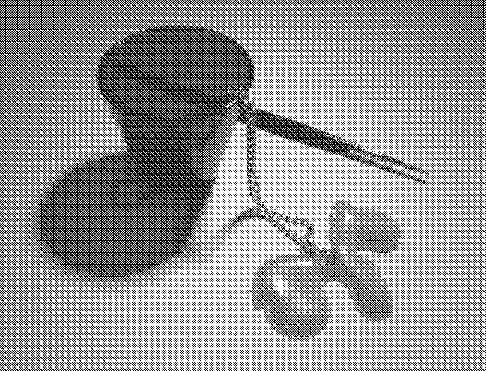
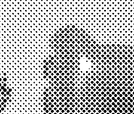

# printable-halftone

## Overview

- a hobby project from 2007
- a plug-in for GIMP
- simulates an analog halftone based on matrix of variable-sized black dots

## History

I made this back in the years, because I wanted to have this kind of
production flow:

1. Draw comics with ink
2. Scan inked pages
3. Add halftones with raster graphics software
4. Laser print the final result 

Problems:
- I liked the aesthetics of analog halftones
- analog halftones as plastic sheets [screentones](https://en.wikipedia.org/wiki/Screentone) were not available anymore
- I couldn't afford commercial software such as Photoshop
- Dense digital halftones (Floyd-Steinberg, ordered dithering)
  tend to give pure black with dark grey inputs
- GIMP had the Newsprint plugin, but back in 2007 it rendered the result
  in square-sized macroblocks which were visible after printing

## Retrospective comment on 2025

Donald Knuth solved the problem in 1987 properly. Alas, at 2007, I was an
undergraduate computer science student who had not discovered Knuth's
article. ;)

Donald E. Knuth. 1987. Digital halftones by dot diffusion. ACM Trans. Graph. 6,
4 (Oct. 1987), 245–273. https://doi.org/10.1145/35039.35040

